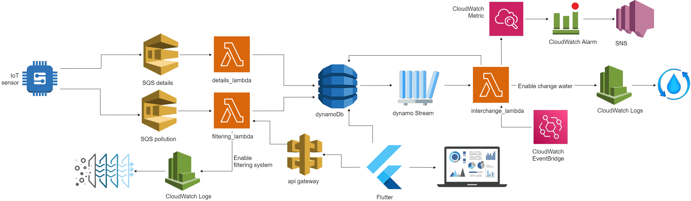

#  IoT AquaWatch

## Implementation of an IoT architecture using Serverless Computing via LocalStack. 
# Smart Control and Emergency Management for Your Aquarium

## Project overview

An aquarium constitutes an artificial environment where the laws of nature are not entirely applicable; what evolves within the aquarium diverges from the complete metabolic cycle observed in nature but endures within the system. Managing the aquarium requires a periodic assessment of water quality. The solution to maintaining a clean environment is the regular water recycling. To ensure a healthy aquatic environment, it is imperative to closely monitor three key water parameters: temperature, pH, and carbonate hardness. Constant monitoring is essential to regulate both the filtration system and the water replacement process efficiently, especially in emergency situations with unstable values. The proposal involves implementing a simulated system capable of autonomously managing water filtration and replacement. This would ensure the constant purification of the aquatic environment, thus contributing to maintaining optimal conditions for the organisms. The project is based on an IoT Cloud architecture where an IoT sensor collect the data and send them on Cloud where they are processed through Serverless Computing and stored in a No-SQL database to be easily accessible.

## Implementation overview

The **IoT sensor** measures water pH, temperature and carbonate hardness. Once the values have been acquired, it sends a message to the "details" **queue** which triggers a "details_lambda" **lambda function**. The function inserts the data including the timestamp into the **Dynamo DB**. 

If one of the values does not respect the range chosen to guarantee adequate water quality, the sensor will send another message in the "pollution" **queue**. The queue will trigger the "filtering_lambda" **lambda function** which will start the water filtering system and save the timestamp in Dynamo DB. It is also possible to activate the filtering system whenever desired with **Api-Gateway** connected to the lambda function which is activated by a simple HTTP POST request. 

Whenever a new timestamp of the filtering system is inserted, **Dynamo Db Stream** captures the stream associated with the table and activates the **lambda function** "interchange_lambda". The function will trigger water replacement system every time the filter system is activated for the third time. Water replacement is also triggered every first day of the month at 8:00 AM by **CloudWatch  EventBridge**. In addition to saving the timestamp in the database, this function will trigger a metric with **CloudWatch Metric**. When the metric exceeds a predefined threshold within a predefined time range (3 times in 10 minutes), **CloudWatch Alarm** will launch an **SNS** topic that will send an email requesting manual assistance.

## Architecture

* **IoT** devices: Measures water pH, temperature and carbonate hardness.
* **Water filtering system**: filters the water for partial purification.
* **Water replacement system**: more accurate water recycling.
* **AWS SQS**: Used to store the messages of IoT sensor. These data are retrieved by the serverless function.
* **AWS Lambda**: Offers the environment where the serverless function is deployed.
* **AWS CloudWatch Logs**: To monitor logs generated by functions
* **AWS DynamoDB**: Utilized to store data, in particular, the water values recorded by the sensor and the timestamps of when the systems were activated.
* **AWS CloudWatch EventBridge**: Implements the rule which invoke the serverless function.
* **AWS Api-Gateway**: Allows to invoke serverless function whenever desire.
* **AWS CloudWatch Metric**: Allow to monitor operational metrics related to the lambda function.
* **AWS CloudWatch Alarm**: Used to automatically alert or react to events in monitored metrics.
* **AWS SNS**: Used to send the mail to user.
* **Flutter**: Dashboard to control and manage recycling system

## Installation and usage
### Prerequisites
1. Docker
2. AWS CLI
3. boto3
4. Flutter
5. Dart

### Setting up the environment

1. Clone the repository
        
        git clone https://github.com/davideiov/smart-irrigation-iot.git
        
2. Launch LocalStack
        
        docker run --rm -it -p 4566:4566 -p 4571:4571 localstack/localstack
        
3. Create the SQS queues that will trigger the lambda functions

        cd python_code
        aws sqs create-queue --queue-name pollution --endpoint-url=http://localhost:4566
        aws sqs create-queue --queue-name details --endpoint-url=http://localhost:4566
   
4. Create the role for lambda functions
           
        aws iam create-role --role-name lambda_role --assume-role-policy-document file://policy_role_lambda.json --query 'Role.Arn' --endpoint-url=http://localhost:4566
		aws iam put-role-policy --role-name lambda_role --policy-name lambda_policy --policy-document file://policy_lambda.json --endpoint-url=http://localhost:4566

5. To create all the services, run the file create_service.py
			        
		python3 create_service.py > output.txt
        
      The file will execute all the necessary functions for creating all the services we need. It will also print the API Gateway endpoint url that we will need later.
       
### Use it

1. Simulate the IoT devices   

		python3 iot_sensor.py
2. Wait the invokation of Lambda functions.
3. Update the endpoint in config.dart file with the url.
4. Run flutter 

		cd ..
		flutter run
5. Manage Dashboard
6. To check creation SNS Topic for the mail 
	
		aws logs describe-log-streams --log-group-name sns/us-east-2/000000000000/SnsTopic --endpoint-url=http://localhost:4566

## Future improvements

* GUI improvements: add other features to the dashboard.
* React to each unexpected value of the water in isolation, focusing on that metric.
* Increase the sensor's number to capture other parameters
* Add management of a food distribution system
* Adapt the entire environment automatically based on the organisms that live there (fish, plants, etc.)
